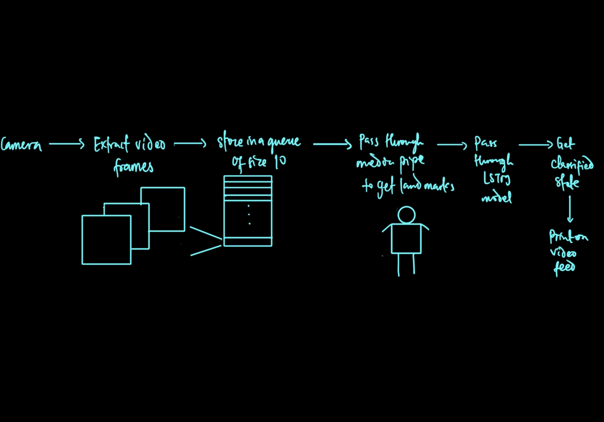
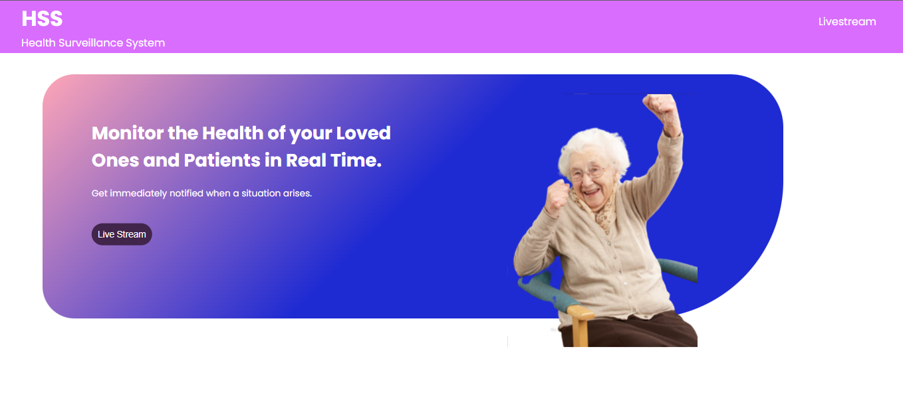
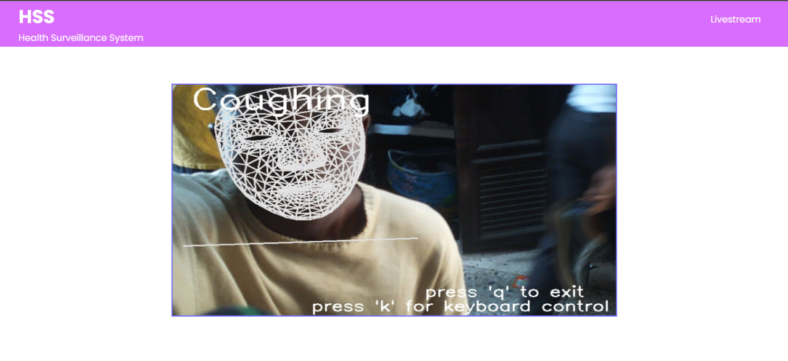

# CamAI

CamAI marries cutting-edge artificial intelligence (AI) with conventional camera technology, bringing about a remarkable transformation in how we perceive and interact with the world. Our AI Camera with Real-Time Action Recognition is powered by  AI algorithms that elevate its capabilities to a whole new level.

By harnessing the potential of AI, our camera becomes more than just a passive observer. It actively comprehends and interprets human actions and movements in real time. From discerning basic actions like walking and running to identifying complex gestures, this camera offers a deeper understanding of human behavior.

### Unlocking New Possibilities:
The applications of our AI Camera with Real-Time Action Recognition are diverse and far-reaching:

- Precision Agriculture: Enhance agricultural practices by monitoring and analyzing human activities in farming environments. Optimize work processes, ensure worker safety, and improve overall efficiency.

- Drive and Traffic Safety Application: Improve road safety by detecting and analyzing critical actions on the roads, such as jaywalking, sudden stops, or reckless driving. This technology can play a crucial role in minimizing accidents and saving lives.

- Informed Security: Elevate the capabilities of traditional surveillance systems by enabling intelligent action recognition. Enhance security measures by identifying suspicious or unauthorized activities in sensitive areas.

- Infrastructure Security: Safeguard important infrastructure by using our AI Camera to detect and alert authorities to unusual or harmful actions that could pose a threat.

https://github.com/iitimii/Raspberry-Pi-Tracking-Camera-plus-Action-Recognition/assets/106264110/a167cb20-c324-4fc2-b70b-95f00f128698

## Hardware
For a test, the hardware is a [Pimoroni pan-tilt hat camera](https://shop.pimoroni.com/products/pan-tilt-hat?variant=22408353287) with an onboard microcontroller which lets you independently drive the two servos (pan and tilt). The module pans and tilts through 180 degrees on each axis and is compatible with all 40-pin header Raspberry Pi models.


## System Design 


- Landmark Extraction
  - ```AI/extract.ipynb```
  - Get the dataset (Videos of actions you want to predict)
  - Select 10 frames, equally spaced across the entire span of the video
  - Pass the frames through the media pipe pose model to extract the pose landmarks
  - Save the landmarks and labels in a NumPy array
  - Link to dataset: https://drive.google.com/drive/folders/1BNY_yB6iyl3XRVcGnUsGTlAjRyRc3ul2?usp=drive_link


- Training
  - ```AI/train.ipynb```
  - Using the extracted landmarks, train an LSTM model along with the label of the action in the video (Data format should be [10 * h * w * c], where h = height, w = width, c = channel of the frame)

- Model Conversion
  - ```AI/tf_lite_convert.ipynb```
  - Convert the trained model to a tflite model to reduce the size of the model and computational costs

- Testing
  - ```AI/test.ipynb```
  - Get the video feed from any camera
  - Stack 10 frames per time in a queue (which will always be updated with an incoming frame)
  - Pass the data in the queue through media pipe to extract important landmarks 
  - Pass the landmarks through the trained model
  - Get the classified result and print it on the video feed

- Tracking
  - There are two tracking modes
  - 1) AI tracking
       - Switch to this mode by clicking "t"
       - The system uses the media pipe pose model to identify the nose of the subject
       - The pan-tilt camera centers on the subject by controlling the servos to minimize the error between the nose of the subject and the center of the camera's view using a bang-bang controller.
  - 2) Keyboard control tracking
       - Switch to this mode by clicking "k"
       - The system uses keyboard inputs to control the pan-tilt camera
       - "w" - up
       - "s" - down
       - "a" - left
       - "d" - right
   
- Here is a video showing first the keyboard control tracking which is then switched to AI tracking:

https://github.com/iitimii/Cam-Ai/assets/106264110/efa98629-38f4-4e97-a09c-19553250e981


## Model Results
- The LSTM model achieved the following results
- Loss: 0.5894
- Accuracy: 0.7817
- Val_Loss: 0.8967
- Val_Accuracy: 0.6873

## Backend Description
The backend was written in python. It's main function is to accept footage streaming from the Raspberry Pi and display it on a client-facing web application.

### Backend Working Principle
- A persistent connection is created using sockets. This links the backend server with the Raspberry Pi.
- The pi transmits the data, which is encoded using OpenCV.
- The footage is then converted to a moving jpeg format and streamed on the front end.
  
### Tools Required for the Backend
- Flask: Flask is a micro web framework written in Python. In this case, it was used to create the web application that would accept the streaming data from the Raspberry Pi. Also, it handled the conversion to moving jpeg and subsequent display on the simple frontend.
- Numpy and NumpySockets: These were used to create a persistent link between the raspberry pi and our local server, through which the footage would be streamed.
  
### Project Run Instructions
- To set up the project, run the following:
  ```
  pip install flask
  pip install opencv-python
  pip install numpy
  pip install numpysocket
  ```
- To launch the web application
  ```
  python3 main.py
  ```
  
  

### Recommendations for Future Backend Implementation
- Adding support for notifications which would be triggered when certain actions are inferred.
- Consider re-implementing using FastAPI, as it is known for it's speed, type-safety (owing to the Pydantic library) and fast-growing community. Furthermore, shares Flask's design philosophy and allows the developer flexibility during implementation.
- Create users and handle support for device-user linkages (one user to one device), and multi-user monitoring (from multiple cameras).


#### To run the program without the web app:
- Transfer the ```run.py``` file to the raspberry pi using the ```scp``` comand (secure copy)
- ```scp <source-file> <user>@<host_ip_address>:<path> ```
- run the ```run.py``` file on the raspberry pi

## Recommendations
- Add servo control to the web application.
- Faster streaming. Increase FPS to avoid lag.
- Training with more data as the model struggles with standing and walking
- Add more actions to the model
