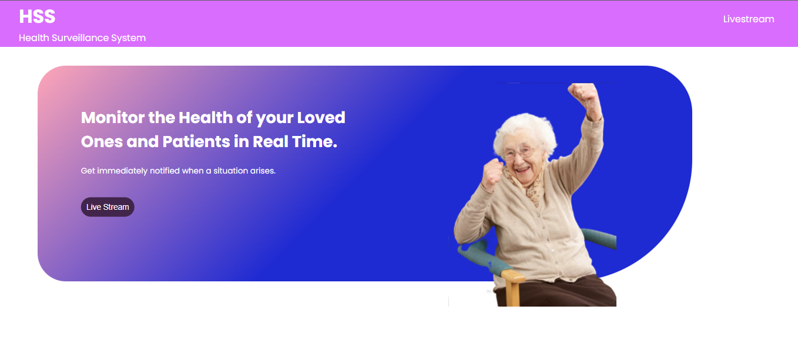
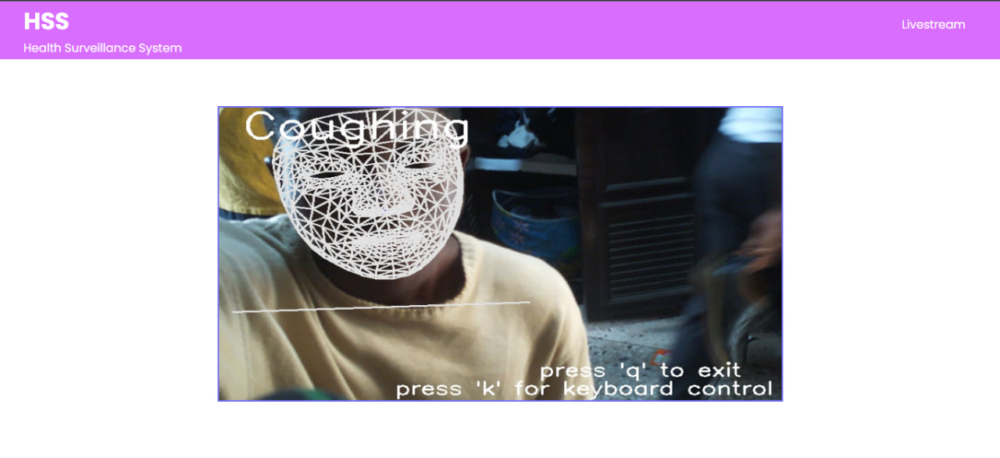

# HEALTH STATUS DETECTION USING RASPBERRY PI AND AI

# Project Description

Innovative healthcare solutions are characterized as being non-invasive, affordable, having reduced response time, and easing the burden on caregivers for the elderly and individuals requiring continual care. This innovative project provides real-time monitoring and action state feedback on the state of medical patients. 

https://github.com/iitimii/Raspberry-Pi-Tracking-Camera-plus-Action-Recognition/assets/106264110/a167cb20-c324-4fc2-b70b-95f00f128698


# General Overview
- From Dataset to Mediapipe to LSTM to Action State

# Model System Design
- The system is designed to monitor the actions of a patient
- Mediapipe was used to extract the landmarks from the video frames 
- The LSTM model was chosen because it could take into account the sequential order of the extracted landmarks to be used for prediction
- The LSTM model uses a sequence of ten successive frames to determine the patient's action
- TensorFlow is faster for creating small models for small projects like this that’s why it was chosen as the deep learning engine

# Model Results


# Hardware
- The pan-tilt hat camera centers a subject by minimizing the error between the nose of the subject and the center of the screen using a bang-bang controller (using a fixed control response)

# Backend Description
The backend handles the streaming of the footage from the Raspberry Pi onto a client-facing web application.

### System Working Principle
- A persistent connection was created using sockets, to link the server with the raspberry pi.
- The pi transmits the data, which was encoded using OpenCV
- The footage was then converted to a moving jpeg format and streamed on the frontend.
  
### Tools Required
- Flask: To create the server
- Numpy and NumpySockets: To create a persistent link between the raspberry pi and our local server, through which the footage would be streamed
  
### Project Run Instructions
- To set up the project, run the following:
  ```
  pip install flask
  pip install opencv-python
  pip install numpy
  pip install numpysocket
  ```
- To launch the web application
  ```
  python3 main.py
  ```
  
  

### Project Recommendations
- Add servo control to the web application. Avoid lag
- Faster streaming. Increase FPS
- Training with more data as the model struggles with standing and walking
https://github.com/iitimii/Raspberry-Pi-Tracking-Camera-plus-Action-Recognition/assets/106264110/a0121018-6a20-448e-89c3-6228e23cdeaa

